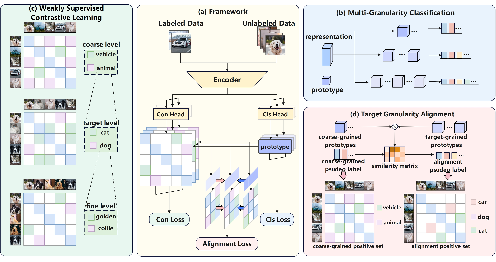

# MGrAC: Multi-Granularity Alignment-Aware Contrastive Learning for Open-World Semi-Supervised Learning


This repository is the official implementation of MGrAC.

## Training
Below is an example demonstrating how to train a model on the CIFAR-100 dataset.
```bash
python train.py --dataset cifar100 --batch_size 256 --epochs 200 --base_lr 0.3
```

## Acknowledgement
Our code are based on [ORCA](https://github.com/snap-stanford/orca), [TRSSL](https://github.com/nayeemrizve/TRSSL), [TIDA](https://github.com/rain305f/TIDA). Thanks for their great work.
